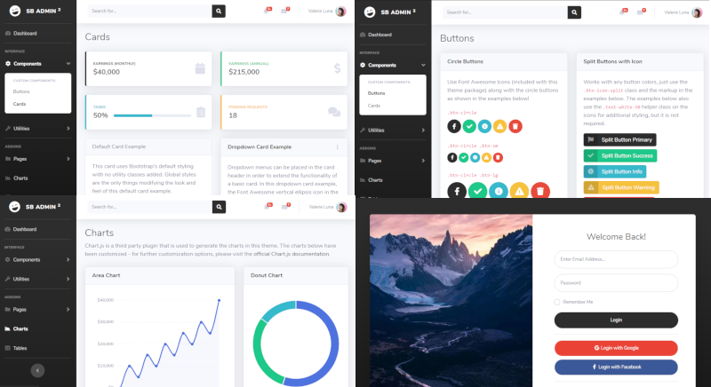

# SBAdmin 2

## Introduction

https://github.com/BlackrockDigital/startbootstrap-sb-admin-2

SB Admin 2 is an open source admin dashboard theme for [Bootstrap](http://getbootstrap.com/) created by [Start Bootstrap](http://startbootstrap.com/).

Fork changes:
* Added PHP server example.
* Moved third party libraries to CDN urls in header.
* Removed gulp.
* npm run scss compilation without dependencies.
* Set primary color to dark.
* Removed "DOG" from login pages.
* Output css has splitted to Bootstrap and SBAdmin css.

## Demo Installation

`composer create-project aphp/sbadmin2 %dir%`

Or clone repository

## SCSS

`cd node` 
`npm install`

Install globals if neded

`npm run install-globals`

Compile

`npm run build-css`

## Server

`cd server` 
`000_startServer.bat` 
`http://localhost`

<b>&#x1F535; Useful links</b>

* Composer package generator
	* [projectGen2](https://github.com/GonistLelatel/projectGen2)
* Cmd windows
	* [WindowsPathEditor](https://rix0rrr.github.io/WindowsPathEditor/)
	* [conemu](https://conemu.github.io/)
* PHP downloads
	* [windows.php.net](https://windows.php.net/)
	* [xampp](https://www.apachefriends.org/ru/index.html)
	* [openserver](https://open-server.soft112.com/)
* PHP installations
	* [install-php-on-windows](https://www.utilizewindows.com/install-php-on-windows/)
	* [phpunit 5](https://phpunit.de/getting-started/phpunit-5.html)
	* [phpunit in bat](https://stackoverflow.com/questions/24861233/phpunit-setup-in-batch-file)
	* [composer in bat](http://leedavis81.github.io/global-installation-of-composer-on-windows/)
* Git client
	* [git](https://gitforwindows.org/)
	* [smartgit](https://www.syntevo.com/smartgit/)
* Node
	* [nodejs install](https://nodejs.org/en/)
	* [node the example package and publication](https://github.com/GonistLelatel/node-example-package-content-type)
	* [javascript ES6 style guide](https://github.com/GonistLelatel/JavaScript-Style-Guide)
* Bootstrap
	* [modals](https://getbootstrap.com/docs/4.3/components/modal/)
	* [buttons](https://getbootstrap.com/docs/4.3/components/buttons/)
	* [inline flex native classes](https://getbootstrap.com/docs/4.3/utilities/flex/)

## More features
For more features:
* Read source code and examples
* Practice with `SBAdmin` in real code
